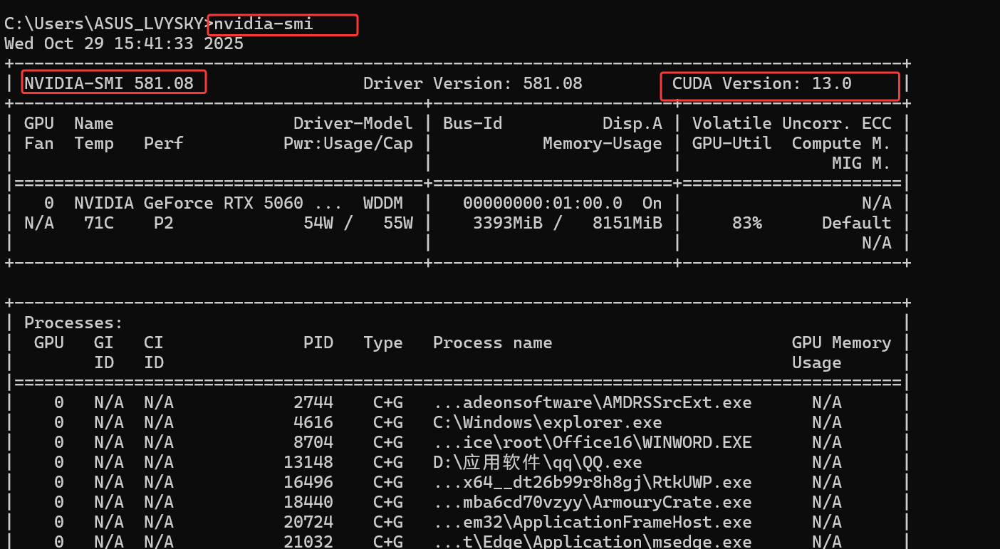
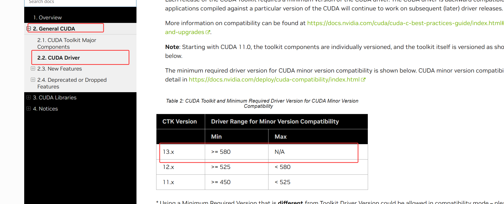
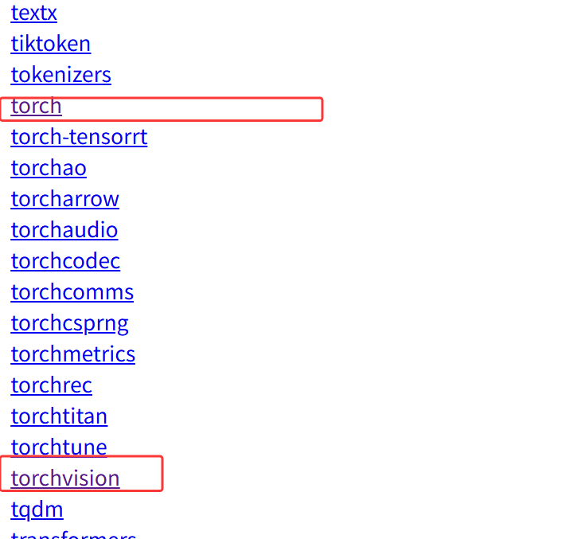
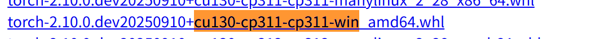
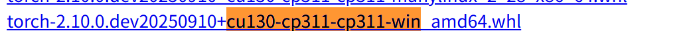
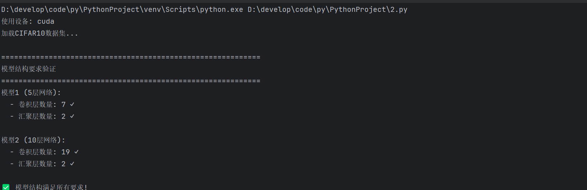
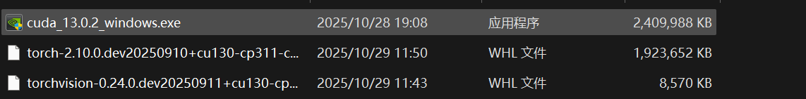

---

title: AIGC全领域修炼手册

published: 2025-10-29

description: "成为AIGC大师，这是第一步"

image: "../images/image-20251029155552724.png"

tags: ["AI", "Blogging","CUDA","PyTorch"]

category: AI

draft: false

---
# PyTorch+CUDA安装（5060显卡）

## 前言

这两个环境算是跑一些AI程序的必备前提。安装非常的麻烦，我来来回回起码浪费了2、3天，才算真正的安好。如果没有显卡的话，就直接安装CPU版本的torch就行了。但是如果有显卡，安装就麻烦多了。

## 安装准备

我的显卡是5060。要下什么版本的CUDA呢？

windows在命令窗输入命令nvidia-smi查看，分别是自己的版本是581.08，支持的CUDA最高版本是13.0。



进入这个网址：https://docs.nvidia.com/cuda/cuda-toolkit-release-notes/index.html#cuda-driver

然后查看，可以看见，必须下载13及以上的版本，因为电脑的版本是581.08：



下载地址是：https://developer.nvidia.com/cuda-toolkit-archive

然后安装torch，要根据python版本和cuda的版本来下，比如cuda13，python3.11，那么下的版本就是cu130，cp311。

下载地址：https://download.pytorch.org/whl/nightly/cu128

找到torch和torchvision：



ctrl+F进行搜索关键字cu130-cp311-cp311-win，即可找到相应版本，然后下载即可。





## 正式安装

在pycharm里面创建一个项目，然后创建python3.11的虚拟环境，激活虚拟环境。

然后在进行安装即可。

```python
# 激活虚拟环境后，卸载torch
pip uninstall torch torchvision torchaudio
# 或者强制卸载
pip uninstall torch -y
# 进入whl文件所在目录，然后执行
pip install torch-2.10.0.dev20250910+cu130-cp311-cp311-win_amd64.whl
# 如果文件路径包含空格或特殊字符，使用引号
pip install "C:\path\to\your\torch-2.10.0.dev20250910+cu130-cp311-cp311-win_amd64.whl"
# 进入whl文件所在目录，然后执行
pip install torchvision-0.24.0.dev20250911+cu130-cp311-cp311-win_amd64.whl
# 或者指定完整路径
pip install "C:\path\to\your\torchvision-0.24.0.dev20250911+cu130-cp311-cp311-win_amd64.whl"

# 确保在项目目录中
cd D:\develop\code\py\PythonProject
# 删除现有虚拟环境（如果需要）
deactivate
rmdir /s venv
# 使用系统Python 3.11创建虚拟环境
D:\develop\py3.11\python.exe -m venv venv
# 激活虚拟环境
venv\Scripts\activate
# 验证Python版本
python --version

```

## 最后

安装完成后就可以开始跑AI程序了，后面创建新项目，就导包就行了。






