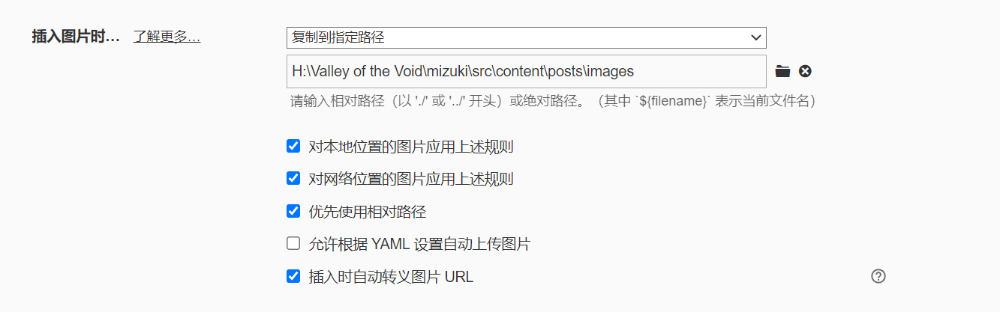
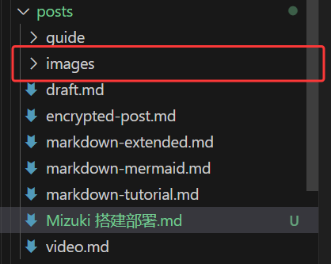
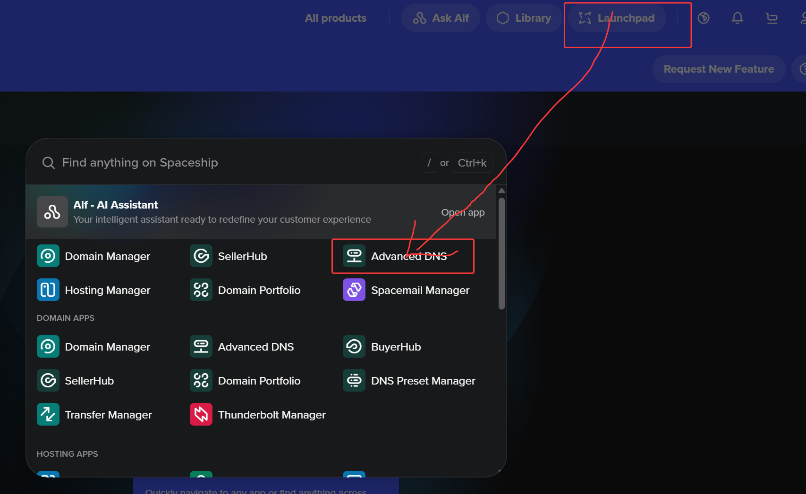
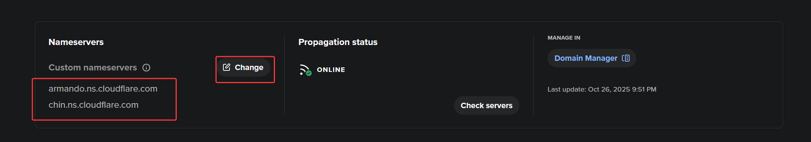
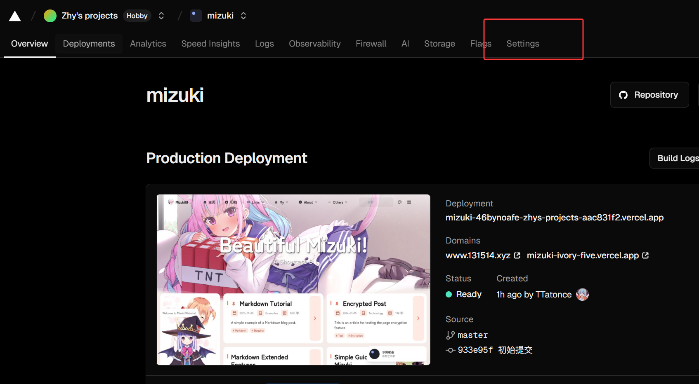
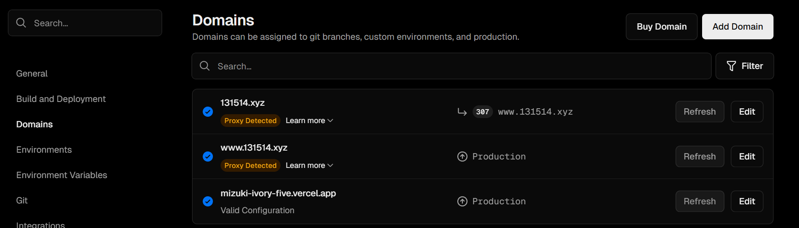
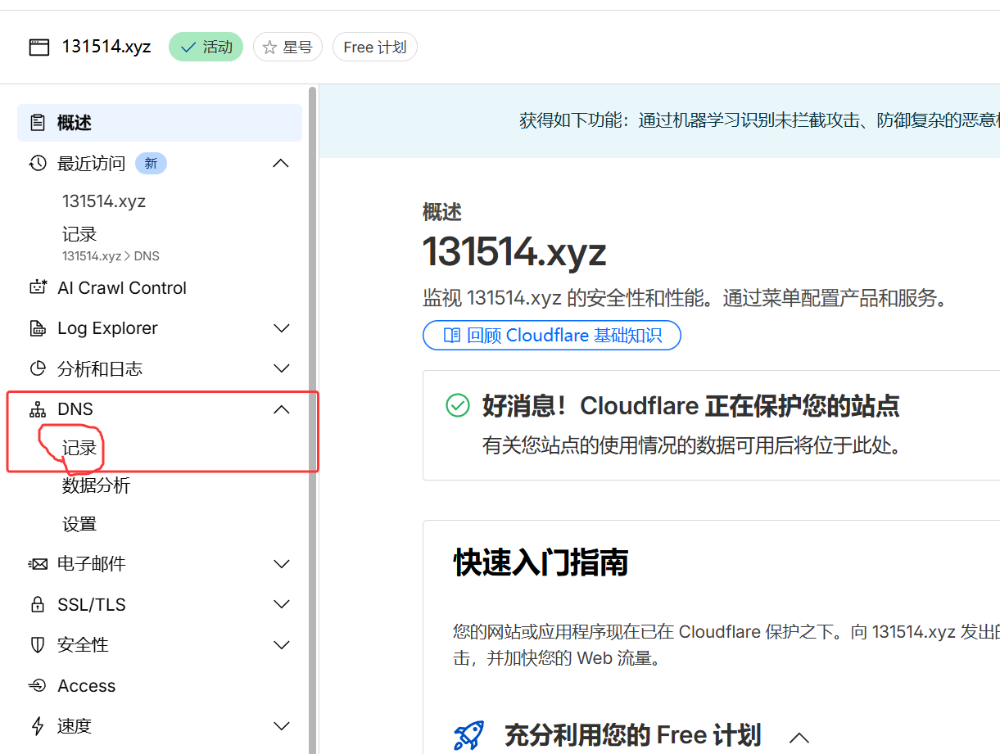
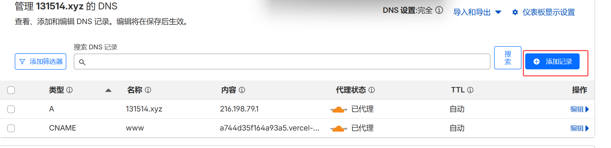

---

title: Mizuki 搭建部署流程

published: 2025-10-27

description: "个人网站的使用方式，安装部署等等。First Blog"

image: "../posts/images/006WHNqygy1hnmrgyltcjj30u00u077u.jpg"

tags: ["Mizuki", "Blogging", "Customization"]

category: Guides

draft: false

---

# Mizuki 搭建部署流程

## 前言

  Mizuki 是一个静态网页，仅仅用于展示内容。而数据都存在本地的。所以没有服务器，其实还是很麻烦。比如图片的存储，还有文件的上传，总之必须要有电脑，才行，和常规的前后端项目不大一样，这种项目没有后台，只能自己全程手动操作。

  首先是图库，写md文件，博客肯定有大量的图片，图片存在哪里呢？我就不专门搭建图床了，可能会崩。就在项目里面创建一个文件夹，专门存放图片。步骤就为：先在posts里面创建markdown文件，好像还有分类。然后就可以直接复制就行了，用的也是相对路径。写markdown的软件当然是Typora。然后还得设置。





然后是主题的一些其他配置，在Mizuki 官网都有，后面慢慢看吧：

网址为：https://docs.mizuki.mysqil.com/

<iframe width="100%" height="600" src="https://docs.mizuki.mysqil.com/" title="YouTube video player" frameborder="0" allow="accelerometer; autoplay; clipboard-write; encrypted-media; gyroscope; picture-in-picture; web-share" allowfullscreen></iframe>

## 部署

### 第一步，安装Mizuki 

安装一些环境，nodejs，pnpm，git

克隆项目，然后安装依赖包。

### 第二步，部署

部署的方式有很多，我选择的是最便宜的方式。那就是Vercel。

首先先上传项目到github，github会很卡怎么办。微软商店下载Watt Toolkit。然后就可以进行网络加速了，就能很快的进入github了。上传到github的步骤，简单说一说，下载注册就不多说了。就谈谈怎么上传。github还要设置SSH令牌才行。这个网上有教程，也不说了。

```git
# 重新初始化（如果需要）
cd 项目目录
git init
git add .
git commit -m "Mizuki 搭建部署流程博客提交"

# 设置远程仓库
git remote add origin https://github.com/用户名/仓库名.git

# 推送
git push -u origin master
```

在谈谈Vercel，进入官网，然后注册账号，绑定GitHub账号，绑定项目， 然后一键即可部署。部署后，有个app后缀的域名，这个必须翻墙才可以访问。所以为了在国内访问，必须去买个域名。

就先谈谈域名怎么买吧，我是在spaceship上下的。网址为：https://www.spaceship.com/ 。六位数加xyz后缀，应该就0.67美元的价格，能买一年。购买教程就放个视频：

<iframe width="100%" height="468" src="https://www.bilibili.com/video/BV12A9pYmEZh/?spm_id_from=333.1391.0.0" title="YouTube video player" frameborder="0" allow="accelerometer; autoplay; clipboard-write; encrypted-media; gyroscope; picture-in-picture; web-share" allowfullscreen></iframe>

买了之后还得激活才行， 要用到cloudflare，网址：https://dash.cloudflare.com/。添加域名，把两个连接复制到spaceship里面去。





这两个网址是在cloudflare添加域名的时候获取的，一定要添加到spaceship里面去，然后cloudflare审核激活，大概10几分钟就能成功激活。激活成功后，就有域名了。然后就得把Vercel的域名换成自定义的了，网址：https://vercel.com/。添加新域名，弄个重定向，所以有两个域名，





创建好了有cname，还有地址，这个要加入到cloudflare的DNS记录中。添加完成后，网站就正式的访问到了。





## 如何更新整个项目

修改代码后，先推到仓库里面去。然后终端运行vercel就行了。vercel命令要安装一个[Vercel CLI](https://vercel.com/docs/cli)才行。


