---

title: 并行处理期末复习笔记

published: 2025-10-28

description: "复习笔记"

image: "../images/LM.png"

tags: ["RM"]

category: RM

draft: false

---

# 并行处理

## 考试题型

- **填空题**（10 分）
- **选择题**（10 分）
- **判断题**（10 分）
- **简答题**（概念、分析、计算，26 分）
- **综合题**（编程、程序理解、分析、论述，44 分）

> **注意**：考试内容全部来源于上课的课件和实验。

---

## 考试内容概览

1. **第一章**：并行计算的基本概念、应用、目的、方法、分类、硬件和软件架构。
2. **第二章（重点）**：并行计算的工作原理、模式、方法、流程、能耗比分析、并行计算分析理论、并行计算机系统结构。
3. **第三章（重点）**：并行编程的语言实现、MPI 并行程序的编程模式、MPI 程序结构、MPI 基础调用、进程、通信域、消息传递、阻塞和挂起。
4. **第四章（重点）**：同步、聚合通信、MPI 数据类型、MPI 派生数据类型（自定义）。
5. **第五章**：异构架构模型基本概念。

## 第一章复习要点

### 一、并行计算的产生

- **背景**：人类对计算和性能的需求无止境，尤其在科学计算、人工智能、绿色计算领域。
- **AI三驾马车**：数据 + 算力 + 算法。
- **满足计算需求的途径**：
  1. 增强硬件（提高指令执行速度）
  2. 优化算法或编译
  3. **使用多个处理机同时解决问题 → 并行计算**

#### 并行计算定义：
- **并行（Parallel）**：同一时刻，多条指令在多个处理器上**同时执行**。
- **并发（Concurrency）**：同一时刻只能有一条指令执行，但多个进程指令**快速轮换执行**，宏观上看似同时执行。

> **摩尔定律**：集成电路上可容纳的晶体管数目约每18个月翻一倍，性能也随之翻倍。  
> **现状**：摩尔定律逐渐失效，串行性能增长趋于稳定，CPU核心数增加，时钟频率与功耗趋于平缓。

#### 并行硬件举例：
- **超线程**：单个物理核心在系统中显示为两个逻辑核心。
- **向量处理器**：一次执行多条指令（如256位宽向量单元可同时执行4个双精度或8个单精度指令）。
- **示例计算**：16核 × 2超线程 × (256位宽 / 64位双精度) = 128路并行  
  串行程序仅使用约 **0.8%** 的理论处理能力。

#### 并行计算的应用领域：
- 高性能计算（HPC）
- 超级计算
- 人工智能
- 大数据处理
- 计算机图形学

#### 并行计算的目标：
1. 减少运行时间（加速）
2. 解决更大规模的问题
3. 提高能源效率

---

### 二、能耗估算公式

**能耗公式：P = N × R × T**

其中：
- P：总能耗（瓦时）
- N：处理器数量
- R：单个处理器功耗（瓦/处理器）
- T：运行时间（小时）

#### 示例：
1. **Intel 16核至强E5-4660**（120W/处理器） × 20处理器 × 24小时 = **57.60 kWh**
2. **NVIDIA Tesla V100**（300W/GPU） × 4 GPU × 12小时 = **14.40 kWh**

> 并行计算可显著降低电力成本，尤其对于大型HPC系统。

---

### 三、并行计算的发展历程

| 时间 | 系统 | 性能 | 备注 |
|------|------|------|------|
| 1960 | UNIVAC LARC | 250 KFLOPS | 最早的超算 |
| 1964 | CDC6600 | 4 MFLOPS | Seymour Cray设计 |
| 1976 | Cray-1 | 250 MFLOPS | 第一台向量流水处理巨型机 |
| 1983 | Cray X-MP | 941 MFLOPS | 两台Cray-1连接 |
| 1985 | Cray-2 | 3.9 GFLOPS | 液冷技术 |
| 1993 | 数值风洞（富士通） | 124.50 GFLOPS | 166个矢量处理器 |
| 1990s | Intel Paragon / Hitachi SR2201 / ASCI Red | 突破1 TFLOPS | 并行架构成熟 |

> **Seymour Cray** 被誉为"超级计算机之父"，其公司曾占据超算市场70%份额。

---

### 四、并行计算研究现状

#### 研究领域：
1. **硬件平台**：高性能计算机与普及型计算机
2. **软件支撑**：并行程序设计
3. **理论基础**：并行算法设计与分析
4. **应用领域**：科学工程与新型应用

#### 并行计算与云计算：
- 云计算是基于互联网的计算模式，共享资源、弹性伸缩。
- 云计算是**分布式计算、并行计算、网格计算**的技术延续。
- 云计算基础架构必须支持并行计算，并实现**计算资源虚拟化**。
- 云计算是**新的资源利用模式**，而非全新技术。

---

> 整理自课件与实验内容，重点掌握标红章节。

## 第二章（重点）

### 工作原理

并行计算通过结合硬件架构、软件设计和并行性理解来开发高性能应用程序。现代计算机系统采用分层架构，从源代码到实际应用需要经过编译器优化、操作系统调度等多个层次。

**并行方法分类：**

- **基于进程的并行化**：创建独立的程序实例，每个进程有独立内存空间，适合分布式系统
- **基于线程的并行化**：在进程内创建多个执行路径，共享内存空间，适合多核处理器
- **向量化**：利用处理器向量单元，单指令操作多个数据，提升计算密度
- **流处理**：使用专用处理器（如GPU）处理数据流，适合大规模并行计算

### 数据并行实现步骤

#### 第一步：问题离散化分解

将复杂问题分解为规则的小单元格或元素，形成结构化计算网格。这种分解使得大规模问题可以被划分为可管理的计算单元，为并行处理奠定基础。

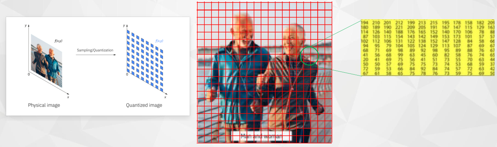

#### 第二步：定义计算核心

为每个网格元素设计计算操作，通常采用stencil模板模式。这种模式使用相邻单元格数据计算新值，适用于图像处理（模糊、锐化）、物理模拟（偏微分方程求解）等场景。

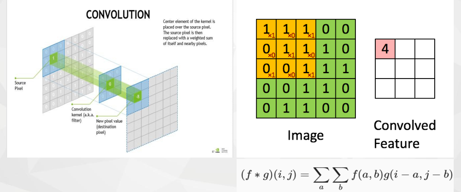

#### 第三步：向量化处理

利用处理器SIMD（单指令多数据）能力，在单个时钟周期内同时处理多个数据元素。这种方法能显著提高计算吞吐量，同时能耗增加很小。

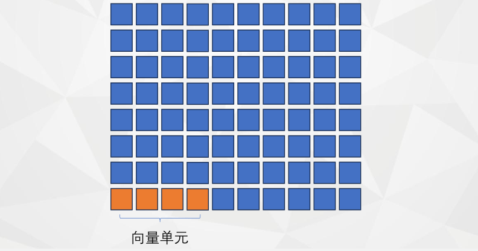

#### 第四步：多线程并行

在多核处理器上部署多个线程，每个线程处理不同的数据子集。通过线程级并行充分利用所有计算核心，提高整体计算效率。

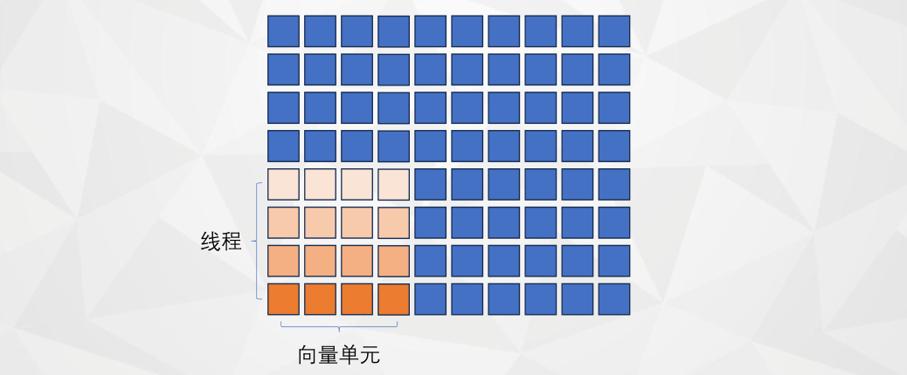

#### 第五步：进程分布式计算

在多台计算机节点间分配计算任务，每个进程拥有独立内存空间。这种模式适合超大规模计算，但需要显式的进程间通信。

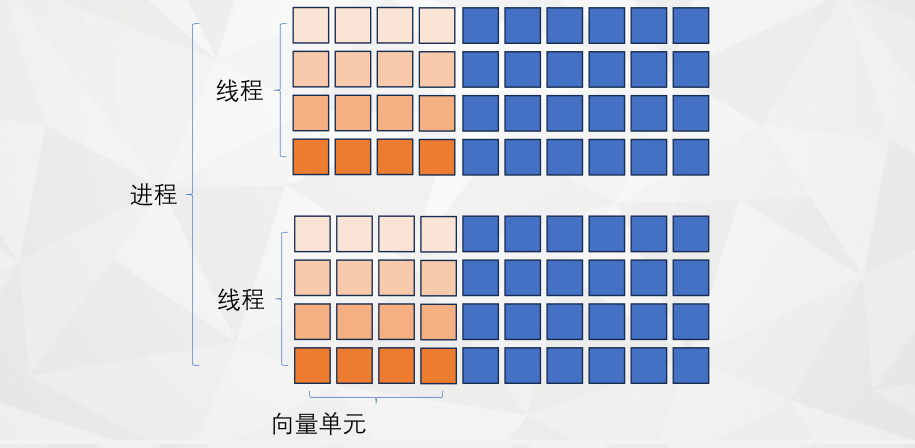

**加速计算示例：**

- 2台PC机：32倍潜在加速（2节点×4核心×4向量宽度）
- 高端集群：4608倍潜在加速（16节点×36核心×8向量宽度）

#### 第六步：GPU加速计算

利用GPU的大量流式多处理器进行大规模并行计算。GPU专为数据并行任务设计，在相同功耗下提供远超CPU的计算能力。

### 并行计算机模型

#### Flynn分类

基于指令流和数据流的并行性分类：

- **SISD**：传统串行架构，单指令流单数据流
- **MISD**：多**指令**流单**数据**流，主要用于容错计算（如航天控制系统）
- **SIMD**：单指令流多数据流，适合向量化和规则数据并行
- **MIMD**：多指令流多数据流，现代多核系统的通用并行模型

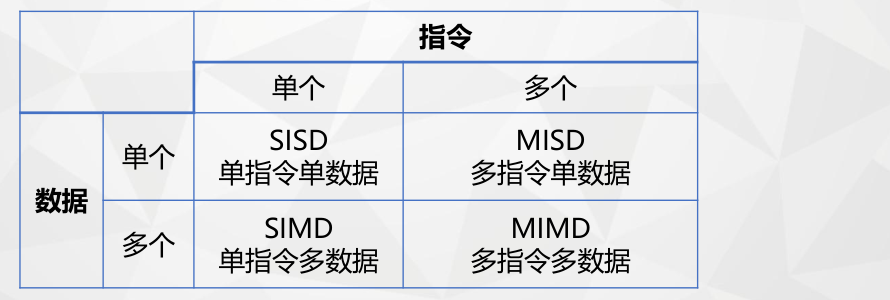

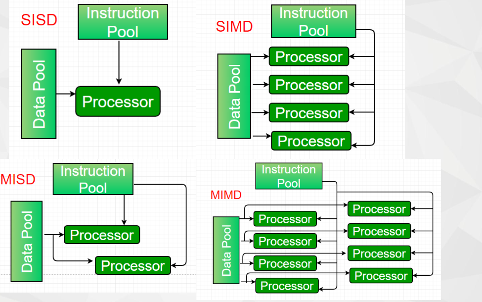

#### 结构模型

**组成要素：** 计算结点 + 互联网络 + 存储系统

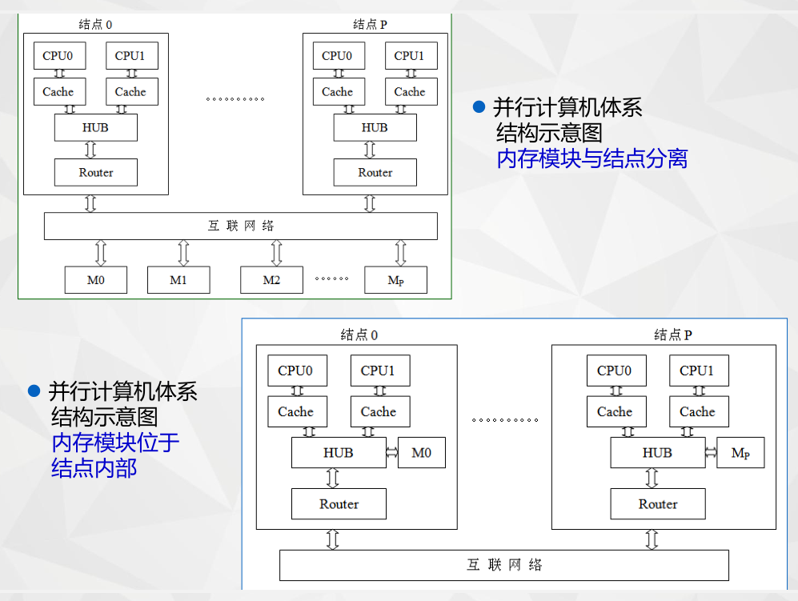

**主要类型：**

- **PVP**：并行向量处理机，专用向量处理器，高性能但成本高
- **SMP**：对称多处理机，共享内存，编程简单但扩展性有限
- **DSM**：分布式共享存储多处理机，物理分布但逻辑统一的内存空间
- **MPP**：大规模并行处理机，大量处理器通过高速网络互联
- **COW**：工作站集群，利用商用组件构建，性价比高

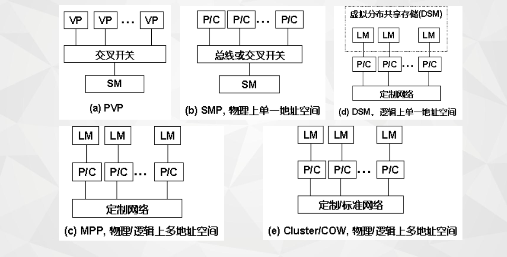

#### 访存模型

描述处理器访问内存的方式和性能特征：

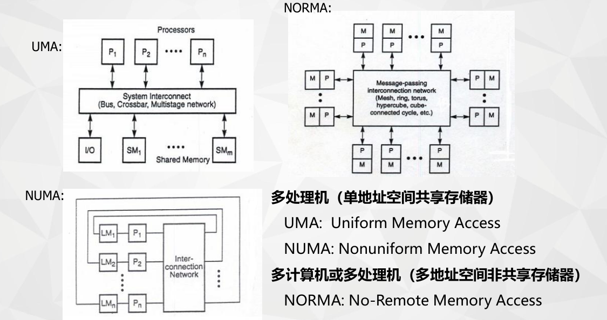

**主要类型：**

- **UMA**：均匀存储器访问，所有处理器访问内存时间相同，实现简单但扩展性差
- **NUMA**：非均匀存储器访问，本地内存访问快，远程内存访问慢，扩展性好但编程复杂
- **NORMA**：非远程存储器访问，仅能访问本地内存，需要通过消息传递进行通信

### 异构并行系统

#### 硬件模型

**分布式内存架构：**

- 每个计算节点拥有独立的本地内存
- 通过高速网络进行节点间通信
- 扩展性极好，适合超大规模计算
- 需要显式数据分布和通信管理

**共享内存架构：**

- 所有处理器共享统一的地址空间
- 数据共享简单，编程模型直观
- 存在缓存一致性和内存竞争问题
- 扩展性受内存带宽限制

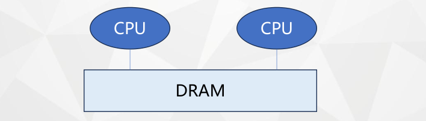

**向量单位：** 

- 专为数据并行设计的执行单元
- 单指令操作多个数据元素
- 能耗效率高，计算密度大
- 需要数据对齐和规则访问模式

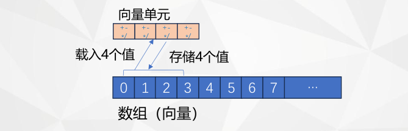

**加速器设备：**

- GPU、FPGA、NPU等专用处理器
- 针对特定计算模式优化
- 在特定任务上远超通用处理器性能
- 需要专门编程模型和数据传输

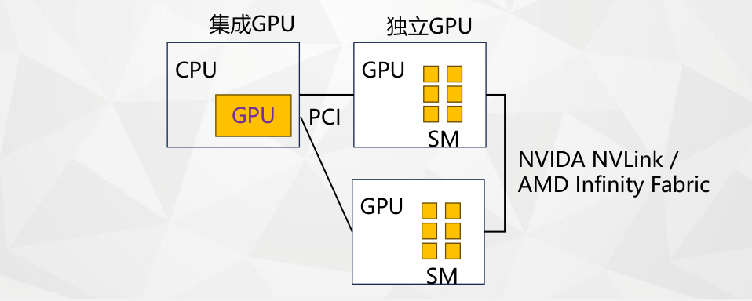

**现代混合架构：**
结合多种硬件优势，形成层次化并行结构：

- CPU负责复杂逻辑和控制流
- GPU负责大规模数据并行计算
- 专用加速器处理特定任务

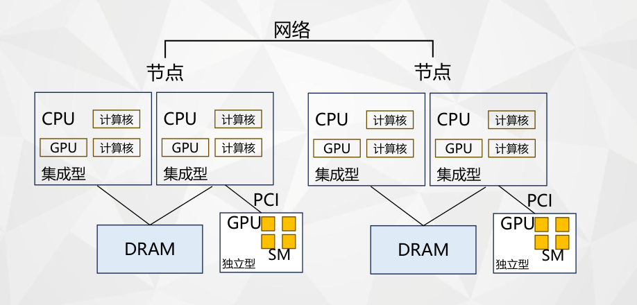

#### 应用程序模型

##### **基于进程的并行化**

消息传递

**消息传递：**

- 基于进程的并行模型
- 通过显式消息进行进程间通信
- 适合分布式内存系统
- MPI是典型实现

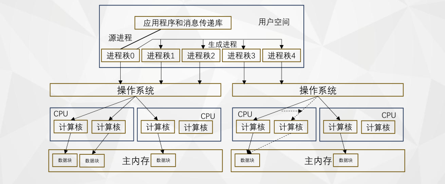

##### **基于线程的并行化**

通过内存共享数据

**基于线程：**

- 在共享内存空间中创建多个执行流
- 通过共享变量进行线程间通信
- 需要同步机制保证数据一致性
- OpenMP是典型实现

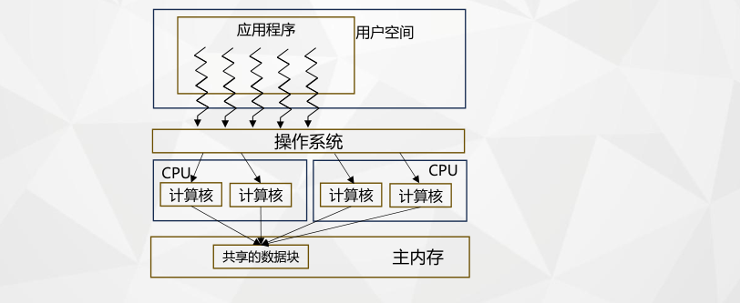

##### **向量化**

使用一条指令执行多个操作

**向量化：**

- 编译器指导或程序员显式指定
- 利用处理器SIMD能力
- 对循环和数组操作特别有效
- 需要数据对齐和连续访问

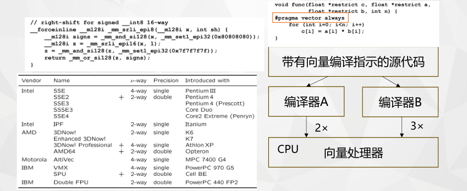

##### **流式处理**

使用专用处理器

**流处理：**

- 将计算任务和数据传输到专用处理器
- 适合计算密集、数据并行的任务
- CUDA、OpenCL是典型编程模型
- 需要管理主机-设备数据传输

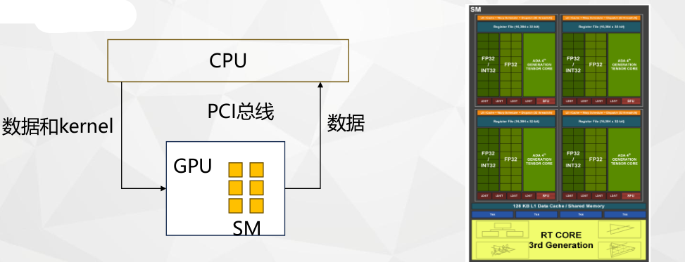

### 并行计算分析理论

#### Amdahl定律

描述固定问题规模下的并行加速极限：

​       Speedup = N + (1 - N) × S

假设问题规模随处理器数量线性增长，强调大规模计算中并行化的价值。

#### 性能瓶颈分析

**关键指标：**

- **计算量(FLOPs)**：算法总浮点运算次数
- **访存量(Bytes)**：算法需要访问的内存总量
- **计算密度**：计算量与访存量比值，决定算法类型

**算法类型：**

- **访存密集型**：计算密度低，性能受内存带宽限制
- **计算密集型**：计算密度高，性能受处理器计算能力限制

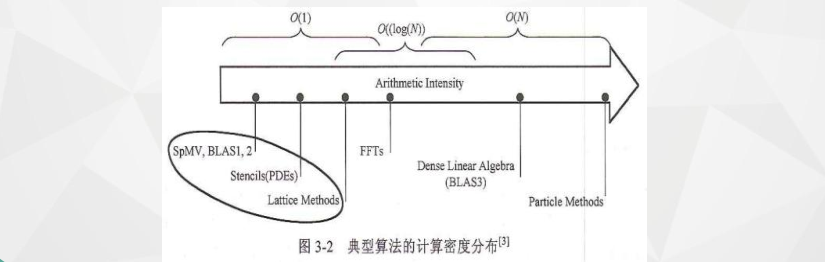

#### Roofline性能模型

综合分析计算和访存性能的评估模型：

- **横轴**：算法计算密度
- **纵轴**：可达计算性能
- **屋顶线**：硬件性能上限
- **优化指导**：识别性能瓶颈，指导优化方向

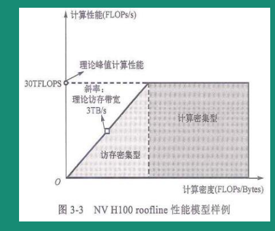

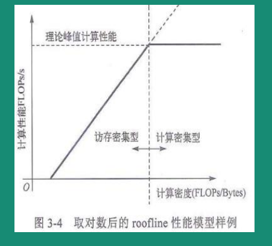

### 典型混合架构系统

#### CPU+GPU架构

**Frontier超算（美国橡树岭国家实验室）：**

- 9408个计算节点，采用HPE Cray EX235a架构
- 每个节点：1×AMD Epyc CPU + 4×AMD MI250X GPU
- 总计37632个GPU核心，9.2PB混合内存
- 峰值性能1.1 EFLOPS，首台百亿亿次超算
- 采用高速互连和分层存储架构

#### CPU+DCU架构

**曙光超算：**

- 采用国产海光处理器和深度计算加速器
- 每个节点：2×海光CPU + 2×海光DCU加速器
- 创新硅立方结构和6D-Torus高维互连网络
- 采用浸没式液体相变冷却技术，能效比优异

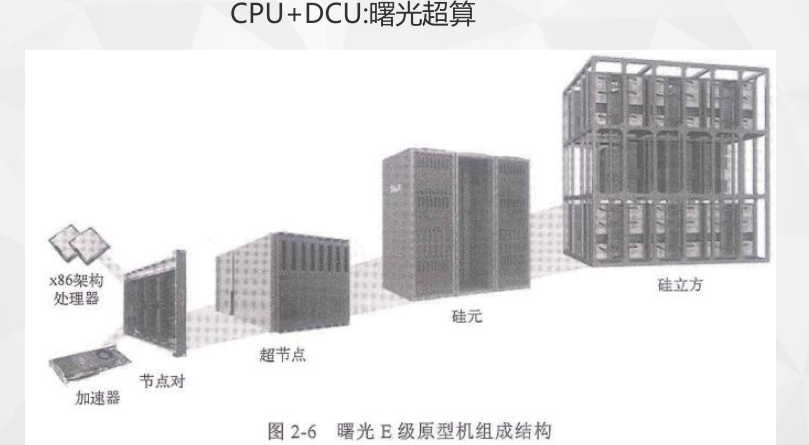

### 新一代天河超算

- 全国产化技术路线：飞腾CPU + Matrix-3000加速器
- 异构架构：每个节点1×CPU + 4×加速器
- 采用ARM指令集，能效比优势明显
- 支持大规模科学计算和人工智能应用

