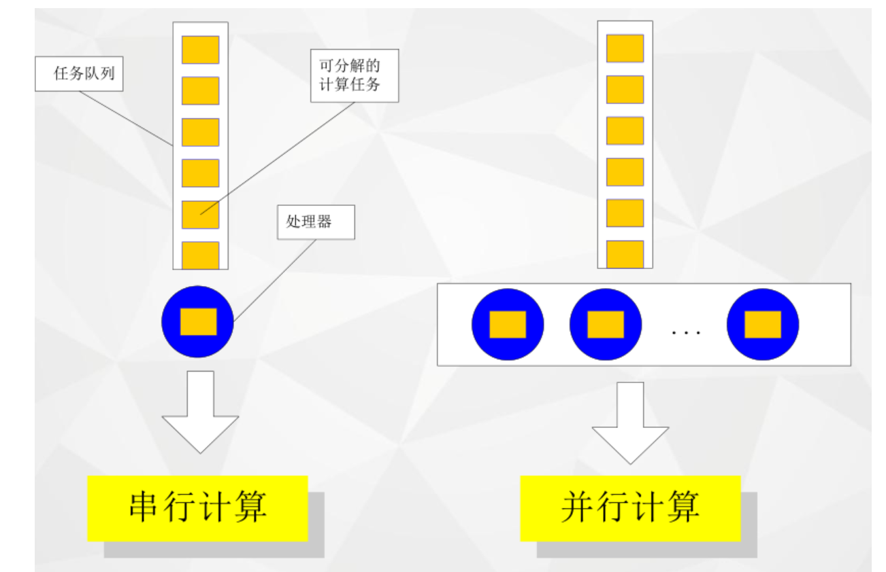
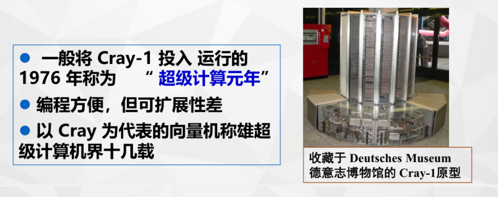
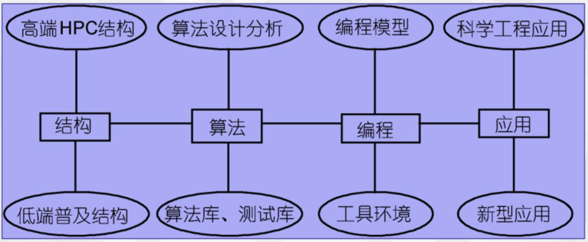

---

title: 并行处理期末复习笔记

published: 2025-10-28

description: "复习笔记"

image: "../images/LM.png"

tags: ["RM"]

category: RM

draft: false

---

# 并行处理

## 考试题型

- **填空题**（10 分）
- **选择题**（10 分）
- **判断题**（10 分）
- **简答题**（概念、分析、计算，26 分）
- **综合题**（编程、程序理解、分析、论述，44 分）

> **注意**：考试内容全部来源于上课的课件和实验。

---

## 考试内容概览

1. **第一章**：并行计算的基本概念、应用、目的、方法、分类、硬件和软件架构。
2. **第二章（重点）**：并行计算的工作原理、模式、方法、流程、能耗比分析、并行计算分析理论、并行计算机系统结构。
3. **第三章（重点）**：并行编程的语言实现、MPI 并行程序的编程模式、MPI 程序结构、MPI 基础调用、进程、通信域、消息传递、阻塞和挂起。
4. **第四章（重点）**：同步、聚合通信、MPI 数据类型、MPI 派生数据类型（自定义）。
5. **第五章**：异构架构模型基本概念。

---

## 第一章复习要点

### 一、并行计算的产生

- **背景**：人类对计算和性能的需求无止境，尤其在科学计算、人工智能、绿色计算领域。
- **AI三驾马车**：数据 + 算力 + 算法。
- **满足计算需求的途径**：
  1. 增强硬件（提高指令执行速度）
  2. 优化算法或编译
  3. **使用多个处理机同时解决问题 → 并行计算**

#### 并行计算定义：
- **并行（Parallel）**：同一时刻，多条指令在多个处理器上**同时执行**。
- **并发（Concurrency）**：同一时刻只能有一条指令执行，但多个进程指令**快速轮换执行**，宏观上看似同时执行。

> **摩尔定律**：集成电路上可容纳的晶体管数目约每18个月翻一倍，性能也随之翻倍。  
> **现状**：摩尔定律逐渐失效，串行性能增长趋于稳定，CPU核心数增加，时钟频率与功耗趋于平缓。

#### 并行硬件举例：
- **超线程**：单个物理核心在系统中显示为两个逻辑核心。
- **向量处理器**：一次执行多条指令（如256位宽向量单元可同时执行4个双精度或8个单精度指令）。
- **示例计算**：16核 × 2超线程 × (256位宽 / 64位双精度) = 128路并行  
  串行程序仅使用约 **0.8%** 的理论处理能力。

#### 并行计算的应用领域：
- 高性能计算（HPC）
- 超级计算
- 人工智能
- 大数据处理
- 计算机图形学

#### 并行计算的目标：
1. 减少运行时间（加速）
2. 解决更大规模的问题
3. 提高能源效率

---

### 二、能耗估算公式

\[
P_{\text{能耗}} = N_{\text{处理器}} \times R_{\text{瓦/处理器}} \times T_{\text{小时}}
\]

#### 示例：
1. **Intel 16核至强E5-4660**（120W/处理器） × 20处理器 × 24小时 = **57.60 kWh**
2. **NVIDIA Tesla V100**（300W/GPU） × 4 GPU × 12小时 = **14.40 kWh**

> 并行计算可显著降低电力成本，尤其对于大型HPC系统。

---

### 三、并行计算的发展历程

| 时间 | 系统 | 性能 | 备注 |
|------|------|------|------|
| 1960 | UNIVAC LARC | 250 KFLOPS | 最早的超算 |
| 1964 | CDC6600 | 4 MFLOPS | Seymour Cray设计 |
| 1976 | Cray-1 | 250 MFLOPS | 第一台向量流水处理巨型机 |
| 1983 | Cray X-MP | 941 MFLOPS | 两台Cray-1连接 |
| 1985 | Cray-2 | 3.9 GFLOPS | 液冷技术 |
| 1993 | 数值风洞（富士通） | 124.50 GFLOPS | 166个矢量处理器 |
| 1990s | Intel Paragon / Hitachi SR2201 / ASCI Red | 突破1 TFLOPS | 并行架构成熟 |

> **Seymour Cray** 被誉为"超级计算机之父"，其公司曾占据超算市场70%份额。

---

### 四、并行计算研究现状

#### 研究领域：
1. **硬件平台**：高性能计算机与普及型计算机
2. **软件支撑**：并行程序设计
3. **理论基础**：并行算法设计与分析
4. **应用领域**：科学工程与新型应用

#### 并行计算与云计算：
- 云计算是基于互联网的计算模式，共享资源、弹性伸缩。
- 云计算是**分布式计算、并行计算、网格计算**的技术延续。
- 云计算基础架构必须支持并行计算，并实现**计算资源虚拟化**。
- 云计算是**新的资源利用模式**，而非全新技术。

---

> 整理自课件与实验内容，重点掌握标红章节。

